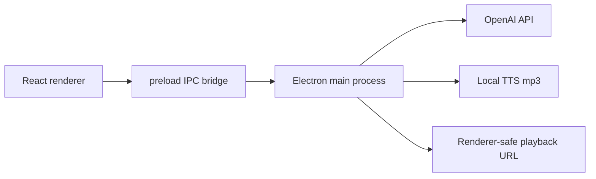

# AI Voice Translator Desktop

> 中文语音输入 -> 语音识别 -> 英文翻译 -> 英文 TTS -> 指定音频输出设备

PC 端单向 Push-to-talk 语音翻译工具。当前 `v0.1.0-alpha` 版本聚焦一个稳定的 MVP 场景：用户说中文，应用识别并翻译为英文，合成英文语音，再播放到扬声器或 VB-Cable / Virtual Audio Cable 等虚拟音频设备，供 Discord、Zoom、Teams 和网页会议选择为麦克风输入。

[English README](#english)

## 当前状态

`v0.1.0-alpha`

这是开发者 alpha 版本，可以用于本地测试和会议链路验证，但还没有打包成 Windows 安装器。

## 核心功能

- Electron + React + TypeScript + Vite 桌面应用。
- 麦克风输入设备选择。
- 音频输出设备选择，支持 Chromium `setSinkId` 时可路由到指定输出设备。
- 手动开始/停止录音。
- 应用窗口聚焦时的 Push-to-talk 快捷键。
- 录音时长显示和简单音量条。
- Mock provider，可离线跑通 ASR -> 翻译 -> TTS 流程。
- OpenAI provider，通过 Electron main process 安全调用。
- OpenAI ASR、翻译、TTS，以及 renderer-safe 音频播放。
- 状态机：

```text
idle -> recording -> transcribing -> translating -> synthesizing -> playing -> idle
```

- UI 展示中文识别文本、英文译文、状态、错误和日志。
- 错误可恢复，用户可回到 `idle` 状态重试。
- 用户可见错误会自动脱敏 `sk-...` API key。
- Vitest 覆盖录音、播放、pipeline、快捷键、日志、错误和 OpenAI bridge。

## 暂不支持

- 不支持双向同传。
- 不捕获系统音频或对方声音。
- 不做流式实时同传。
- 不做声音克隆。
- 不做账号、支付、云同步。
- 不自研虚拟声卡驱动。
- 暂无安装包，需要使用 `npm run dev` 启动。
- 应用不聚焦时，暂不能可靠检测全局快捷键“松开”事件。

## 快速开始

```powershell
git clone https://github.com/homerlamlam/AI-Voice-Translator-Desktop.git
cd AI-Voice-Translator-Desktop\voice-translator-desktop
npm install
npm run dev
```

请使用自动弹出的 Electron 桌面窗口。OpenAI 模式依赖 Electron desktop bridge，不能在普通浏览器标签页里完整运行。

## OpenAI 配置

创建本地环境文件：

```powershell
Copy-Item .env.example .env.local
notepad .env.local
```

填写：

```env
SPEECH_PROVIDER=mock
OPENAI_API_KEY=your_new_openai_key
OPENAI_TRANSCRIPTION_MODEL=gpt-4o-mini-transcribe
OPENAI_TRANSLATION_MODEL=gpt-4o-mini
OPENAI_TTS_MODEL=gpt-4o-mini-tts
```

重启应用：

```powershell
npm run dev
```

在 UI 中：

- 确认 `Desktop bridge: available`。
- `Speech provider` 选择 `OpenAI provider`。
- 选择真实麦克风。
- 选择输出设备。
- 点击开始/停止录音，或在应用窗口聚焦时按住/松开 Push-to-talk 快捷键。

## API Key 安全

- 不要提交 `.env.local`，它已经在 `.gitignore` 中。
- 不要把 API key 放进截图、Issue、聊天记录或 README。
- 如果 key 已经泄露，请立即在服务商后台 revoke/rotate。
- React renderer 不读取 `OPENAI_API_KEY`。
- OpenAI 请求只在 Electron main process 中执行。
- 用户可见错误会把 `sk-...` token 替换为 `[REDACTED_API_KEY]`。

## 配合虚拟音频设备使用

如果你希望会议软件听到翻译后的英文语音：

1. 安装 VB-Cable、Virtual Audio Cable 或其他虚拟音频设备。
2. 如果新设备没有出现，重启本应用。
3. 在本应用中，`Microphone input` 选择真实麦克风。
4. 在本应用中，`Audio output` 选择虚拟线缆输出，常见名称是 `CABLE Input`。
5. 在 Discord、Zoom、Teams 或网页会议中，麦克风输入选择匹配的虚拟设备，常见名称是 `CABLE Output`。

本项目不会安装或实现虚拟声卡驱动，只会把生成的音频播放到操作系统已经暴露的输出设备。

## 开发命令

```powershell
cd voice-translator-desktop
npm run dev
```

质量检查：

```powershell
npm run test
npm run lint
npm run build
```

格式化：

```powershell
npm run format
```

## 项目结构

```text
voice-translator-desktop/
  apps/
    desktop/
      src/
        main/                    Electron main process, preload, IPC, OpenAI bridge
        renderer/                React UI
        services/
          audio/                 Device enumeration, recorder, player
          config/                Local settings
          hotkeys/               Push-to-talk matching
          logging/               Log entry creation and error logs
          speech/                Pipeline and providers
          state/                 Speech state machine
        tests/                   Vitest tests
        types/                   Shared types and error codes
  docs/                          Product, audio routing, API contract, test plan
  RELEASE_NOTES.md               Alpha release notes
```

## 架构



OpenAI 模式的安全边界：



## Provider

### Mock Provider

Mock provider 返回固定中文识别文本、固定英文译文，并使用生成的测试音。适合离线开发和 UI 测试。

### OpenAI Provider

OpenAI provider 分为 renderer 和 main process 两部分：

- Renderer provider 通过 IPC 发送音频字节和文本。
- Main process 读取 `.env.local` 或系统环境变量。
- Main process 调用 OpenAI。
- TTS 输出保存到本地 app data。
- 播放使用 renderer-safe audio URL，而不是从 Vite 页面直接读取 `file://`。

## 错误码

- `MIC_PERMISSION_DENIED`
- `MIC_DEVICE_NOT_FOUND`
- `RECORDING_FAILED`
- `ASR_FAILED`
- `TRANSLATION_FAILED`
- `TTS_FAILED`
- `AUDIO_OUTPUT_FAILED`
- `HOTKEY_REGISTER_FAILED`
- `CONFIG_LOAD_FAILED`

## 常见问题

### `Desktop OpenAI bridge is not available`

通常说明你在普通浏览器里打开了 Vite 页面。请使用 `npm run dev` 自动弹出的 Electron 桌面窗口。

### `ASR_FAILED: fetch failed`

旧版本使用 Node `fetch`，可能没有走 Electron/系统网络路径。当前版本已改用 Electron `net.fetch`。请拉取最新代码并重启应用。

### `AUDIO_OUTPUT_FAILED`

请检查：

- 选择的输出设备是否存在。
- 设备是否断开。
- 是否有其他应用独占设备。
- 如果使用虚拟音频线缆，本应用选择 `CABLE Input`，会议软件选择 `CABLE Output`。

### OpenAI Provider 被禁用

OpenAI 模式需要 `Desktop bridge: available`。普通浏览器中会被故意禁用。

## 路线图

1. 原生全局键盘 hook，实现后台 Push-to-talk 按下/松开。
2. 设置页：模型、voice、目标语言、快捷键、设备。
3. 拆分 provider：ASR provider、Translation provider、TTS provider。
4. 接入 DeepSeek 或其他文本模型用于翻译。
5. TTS 输出文件清理策略。
6. Windows 安装包。
7. 30 分钟稳定性测试和会议软件兼容性矩阵。

## 文档

- [产品需求](voice-translator-desktop/docs/product-requirements.md)
- [音频路由](voice-translator-desktop/docs/audio-routing.md)
- [API 契约](voice-translator-desktop/docs/api-contract.md)
- [测试计划](voice-translator-desktop/docs/test-plan.md)
- [Release notes](voice-translator-desktop/RELEASE_NOTES.md)

---

<a id="english"></a>

# AI Voice Translator Desktop

> Chinese microphone input -> ASR -> English translation -> English TTS -> selected audio output device

A PC desktop MVP for one-way push-to-talk voice translation. The current `v0.1.0-alpha` release focuses on one stable workflow: speak Chinese, translate it into English, synthesize English speech, and route the generated audio to a speaker or a virtual audio device for Discord, Zoom, Teams, and browser meetings.

## Status

`v0.1.0-alpha`

This is an early developer alpha. It is usable for local testing and meeting-routing experiments, but it is not packaged as a Windows installer yet.

## Features

- Electron + React + TypeScript + Vite desktop app.
- Microphone input device selection.
- Audio output device selection with Chromium `setSinkId` support.
- Manual recording controls.
- Focused-window push-to-talk hotkey.
- Recording duration and simple volume meter.
- Mock provider for offline end-to-end testing.
- OpenAI provider through the Electron main-process bridge.
- OpenAI ASR, translation, TTS, and renderer-safe audio playback.
- Runtime state machine:

```text
idle -> recording -> transcribing -> translating -> synthesizing -> playing -> idle
```

- Source Chinese text and English translation display.
- Status, recoverable errors, and info/error logs.
- API key redaction in user-visible errors.
- Vitest coverage for recorder, player, pipeline, hotkeys, logger, errors, and OpenAI bridge.

## Not Supported Yet

- No two-way interpretation.
- No system audio capture.
- No streaming simultaneous interpretation.
- No voice cloning.
- No account system, payments, or cloud sync.
- No custom virtual audio driver.
- No installer package yet.
- No reliable global key-release detection when the app is not focused.

## Quick Start

```powershell
git clone https://github.com/homerlamlam/AI-Voice-Translator-Desktop.git
cd AI-Voice-Translator-Desktop\voice-translator-desktop
npm install
npm run dev
```

Use the Electron desktop window that opens. Do not use a normal browser tab for OpenAI mode because OpenAI calls require the Electron desktop bridge.

## OpenAI Configuration

Create a local environment file:

```powershell
Copy-Item .env.example .env.local
notepad .env.local
```

Fill in:

```env
SPEECH_PROVIDER=mock
OPENAI_API_KEY=your_new_openai_key
OPENAI_TRANSCRIPTION_MODEL=gpt-4o-mini-transcribe
OPENAI_TRANSLATION_MODEL=gpt-4o-mini
OPENAI_TTS_MODEL=gpt-4o-mini-tts
```

Restart the app:

```powershell
npm run dev
```

In the UI:

- Confirm `Desktop bridge: available`.
- Select `OpenAI provider`.
- Select your microphone.
- Select your output device.
- Record and stop, or hold/release the push-to-talk hotkey while the app window is focused.

## API Key Safety

- Do not commit `.env.local`; it is already ignored by Git.
- Do not paste API keys into screenshots, issues, chat logs, or README files.
- If a key is leaked, revoke it and generate a new one.
- The React renderer never reads `OPENAI_API_KEY`.
- OpenAI requests run in the Electron main process.
- User-visible errors redact `sk-...` tokens as `[REDACTED_API_KEY]`.

## Audio Routing With Virtual Cable

To send translated English audio into meeting apps:

1. Install VB-Cable, Virtual Audio Cable, or another virtual audio device.
2. Restart this app if the new device does not appear.
3. In this app, set `Microphone input` to your real microphone.
4. In this app, set `Audio output` to the virtual cable output, commonly `CABLE Input`.
5. In Discord, Zoom, Teams, or browser meetings, set microphone input to the matching virtual device, commonly `CABLE Output`.

This project does not install or implement a virtual audio driver. It only plays generated audio to output devices already exposed by the operating system.

## Development

```powershell
cd voice-translator-desktop
npm run dev
```

Quality checks:

```powershell
npm run test
npm run lint
npm run build
```

Format:

```powershell
npm run format
```

## Architecture

```mermaid
flowchart LR
  Mic["System microphone"] --> Recorder["AudioRecorderService"]
  Recorder --> Pipeline["SpeechPipeline"]
  Pipeline --> ASR["ASR provider"]
  ASR --> Translation["Translation provider"]
  Translation --> TTS["TTS provider"]
  TTS --> Player["AudioPlayerService"]
  Player --> Output["Selected output device"]
  Output --> Meeting["Discord / Zoom / Teams"]
```


OpenAI mode uses a secure boundary:


## Roadmap

1. Native global keyboard hook for true background push-to-talk press/release.
2. Settings page for models, voice, target language, hotkey, and devices.
3. Provider split: ASR provider, translation provider, TTS provider.
4. DeepSeek or other text-only providers for translation.
5. TTS output cleanup policy.
6. Windows installer.
7. 30-minute stability test and meeting-app compatibility matrix.
