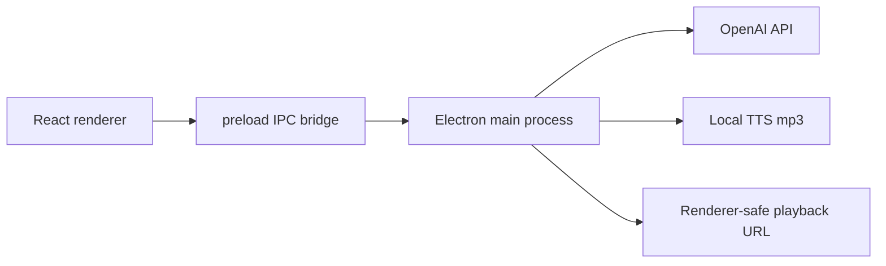

# AI Voice Translator Desktop

Desktop MVP for one-way push-to-talk voice translation:

```text
Chinese microphone input -> ASR -> English translation -> TTS -> selected audio output
```

The first alpha focuses on a stable single-user workflow: speak Chinese, translate to English, synthesize English speech, and route the generated audio to a speaker or virtual audio cable for Discord, Zoom, Teams, and browser meetings.

## Status

`v0.1.0-alpha`

This is an early developer alpha. It is usable for local testing, but it is not packaged as an installer yet.

## Features

- Electron + React + TypeScript + Vite desktop app.
- Microphone input device selection.
- Audio output device selection with Chromium `setSinkId` support.
- Manual recording controls.
- Focused-window push-to-talk hotkey.
- Recording duration and simple volume meter.
- Mock provider for offline end-to-end testing.
- OpenAI provider through the Electron main-process bridge.
- OpenAI ASR, translation, TTS, and renderer-safe audio playback.
- Status machine:

```text
idle -> recording -> transcribing -> translating -> synthesizing -> playing -> idle
```

- Source Chinese text and English translation display.
- Info/error logs with recoverable error state.
- API key redaction in user-visible errors.
- Vitest coverage for recorder, player, pipeline, hotkeys, logger, errors, and OpenAI bridge.

## What This App Does Not Do Yet

- No two-way simultaneous interpretation.
- No system audio capture.
- No streaming real-time interpretation.
- No voice cloning.
- No account, payment, or cloud sync.
- No custom virtual audio driver.
- No packaged installer yet.
- No reliable global key-release detection when the app is not focused.

## Quick Start

```powershell
git clone https://github.com/homerlamlam/AI-Voice-Translator-Desktop.git
cd AI-Voice-Translator-Desktop\voice-translator-desktop
npm install
npm run dev
```

Use the Electron desktop window that opens. Do not use a normal browser tab for OpenAI mode, because OpenAI calls require the Electron desktop bridge.

## OpenAI Configuration

Create a local environment file:

```powershell
Copy-Item .env.example .env.local
notepad .env.local
```

Fill in:

```env
SPEECH_PROVIDER=mock
OPENAI_API_KEY=your_new_openai_key
OPENAI_TRANSCRIPTION_MODEL=gpt-4o-mini-transcribe
OPENAI_TRANSLATION_MODEL=gpt-4o-mini
OPENAI_TTS_MODEL=gpt-4o-mini-tts
```

Then restart the desktop app:

```powershell
npm run dev
```

In the UI:

- Confirm `Desktop bridge: available`.
- Select `OpenAI provider`.
- Select your microphone.
- Select your output device.
- Record and stop, or hold/release the push-to-talk hotkey while the app window is focused.

## API Key Safety

- Never commit `.env.local`; it is already ignored by Git.
- Do not paste API keys into screenshots, issues, chat logs, or README files.
- If a key is accidentally shared, revoke it and generate a new one.
- The React renderer never reads `OPENAI_API_KEY`.
- OpenAI requests run in the Electron main process.
- User-visible errors redact `sk-...` tokens as `[REDACTED_API_KEY]`.

## Audio Routing With Virtual Cable

To send translated English audio into meeting apps:

1. Install VB-Cable, Virtual Audio Cable, or another virtual audio device.
2. Restart this app if the new device does not appear.
3. In this app, set `Microphone input` to your real microphone.
4. In this app, set `Audio output` to the virtual cable output, commonly `CABLE Input`.
5. In Discord, Zoom, Teams, or browser meetings, set the microphone input to the matching virtual device, commonly `CABLE Output`.

This project does not install or implement a virtual audio driver. It only plays generated audio to output devices already exposed by the operating system.

## Daily Development

```powershell
cd voice-translator-desktop
npm run dev
```

Quality checks:

```powershell
npm run test
npm run lint
npm run build
```

Formatting:

```powershell
npm run format
```

## Project Structure

```text
voice-translator-desktop/
  apps/
    desktop/
      src/
        main/                    Electron main process, preload, IPC, OpenAI bridge
        renderer/                React UI
        services/
          audio/                 Device enumeration, recorder, player
          config/                Local settings
          hotkeys/               Push-to-talk matching
          logging/               Log entry creation and error logs
          speech/                Pipeline and providers
          state/                 Speech state machine
        tests/                   Vitest tests
        types/                   Shared types and error codes
  docs/                          Product, audio routing, API contract, test plan
  RELEASE_NOTES.md               Alpha release notes
```

## Architecture

```mermaid
flowchart LR
  Mic["System microphone"] --> Recorder["AudioRecorderService"]
  Recorder --> Pipeline["SpeechPipeline"]
  Pipeline --> ASR["ASR provider"]
  ASR --> Translation["Translation provider"]
  Translation --> TTS["TTS provider"]
  TTS --> Player["AudioPlayerService"]
  Player --> Output["Selected output device"]
  Output --> Meeting["Discord / Zoom / Teams"]
```



OpenAI mode uses a secure boundary:



## Providers

### Mock Provider

The mock provider returns fixed ASR text, a fixed English translation, and a generated test tone. Use it for offline development and UI testing.

### OpenAI Provider

The OpenAI provider is split across renderer and main process:

- Renderer provider sends audio bytes and text through IPC.
- Main process reads `.env.local` or process environment variables.
- Main process calls OpenAI.
- TTS output is saved to local app data.
- Playback uses a renderer-safe audio URL instead of directly loading `file://` from the Vite page.

## Error Codes

- `MIC_PERMISSION_DENIED`
- `MIC_DEVICE_NOT_FOUND`
- `RECORDING_FAILED`
- `ASR_FAILED`
- `TRANSLATION_FAILED`
- `TTS_FAILED`
- `AUDIO_OUTPUT_FAILED`
- `HOTKEY_REGISTER_FAILED`
- `CONFIG_LOAD_FAILED`

## Troubleshooting

### `Desktop OpenAI bridge is not available`

You are likely using a normal browser tab. Start with `npm run dev` and use the Electron desktop window.

### `ASR_FAILED: fetch failed`

Older builds used Node `fetch`, which may not follow the same network path as Electron. Current builds use Electron `net.fetch`. Pull the latest code and restart the app.

### `AUDIO_OUTPUT_FAILED`

Check:

- The selected output device exists.
- The device was not disconnected.
- Another app is not holding the device exclusively.
- For virtual cable routing, choose `CABLE Input` in this app and `CABLE Output` in the meeting app.

### OpenAI Provider Is Disabled

OpenAI mode requires `Desktop bridge: available`. It is intentionally disabled in a normal browser.

## Roadmap

1. Native global keyboard hook for true background push-to-talk press/release.
2. Settings page for models, voice, target language, hotkey, and devices.
3. Provider split: ASR provider, translation provider, TTS provider.
4. DeepSeek or other text-only providers for translation.
5. TTS output cleanup policy.
6. Packaged Windows installer.
7. 30-minute stability test and meeting app compatibility matrix.

## Documentation

- [Product requirements](docs/product-requirements.md)
- [Audio routing](docs/audio-routing.md)
- [API contract](docs/api-contract.md)
- [Test plan](docs/test-plan.md)
- [Release notes](RELEASE_NOTES.md)
